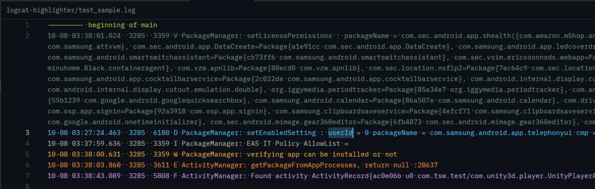

# Logcat Highlighter

Syntax highlighting for Android Logcat files, providing clear visual distinction between log levels and components.

## Features

- **Level-based Highlighting**: Distinct colors for Verbose, Debug, Info, Warning, Error, and Fatal logs.
- **Smart Parsing**: Powered by [tree-sitter-logcat](https://github.com/vinnom/tree-sitter-logcat) for accurate syntax highlighting.
- **File Support**: Automatically detects `.log` and `.logcat` files.

## Installation

This extension is compatible with editors that support Tree-sitter grammars.

### Zed

To use this extension in [Zed](https://zed.dev):

1. Clone this repository.
2. Link or copy it into your local Zed extensions directory.

## Usage

Opening any file with a `.log` or `.logcat` extension will automatically trigger the highlighter.

## Project Structure

- `languages/logcat`: Contains the language configuration (`config.toml`) and syntax highlighting queries (`highlights.scm`).
- `extension.toml`: Extension metadata and grammar definitions.

## License

This project is licensed under the MIT License - see the [LICENSE](LICENSE) file for details.
